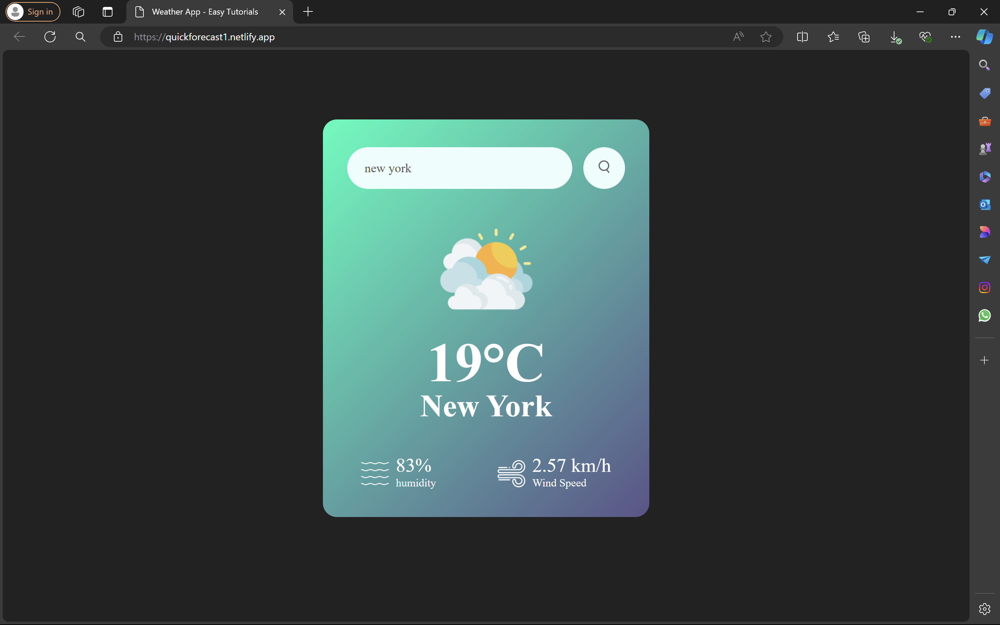

# Weather App

A simple weather application built with HTML, CSS, and JavaScript. This app allows users to check the current weather, humidity, and wind speed for any city using a weather API.

## Features

- Search for the weather of a particular city using a search bar.
- Display current weather, humidity, and wind speed.
- Responsive and user-friendly design.

## Installation

1. Clone the repository:

    ```bash
    git clone https://github.com/PaarthAgarwal1/weather-app.git
    ```

2. Navigate to the project directory:

    ```bash
    cd weather-app
    ```

3. Open the `index.html` file in your browser to view the app.

## Usage

1. Enter the name of the city in the search bar.
2. Press Enter or click the search button.
3. The app will display the weather, humidity, and wind speed for the entered city.

## Screenshots



## Deployment

The app is deployed and live at [https://quickforecast1.netlify.app/](https://quickforecast1.netlify.app/).

